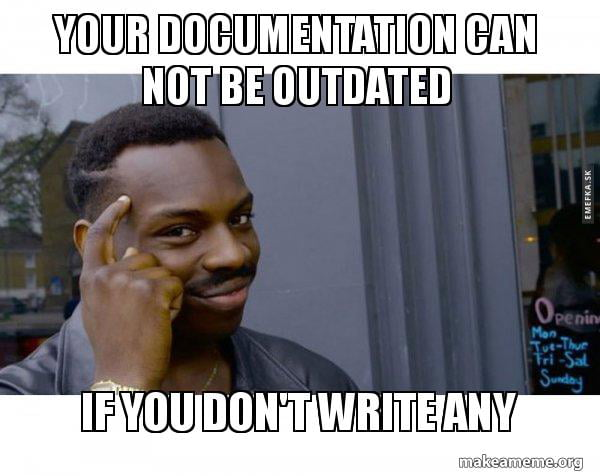
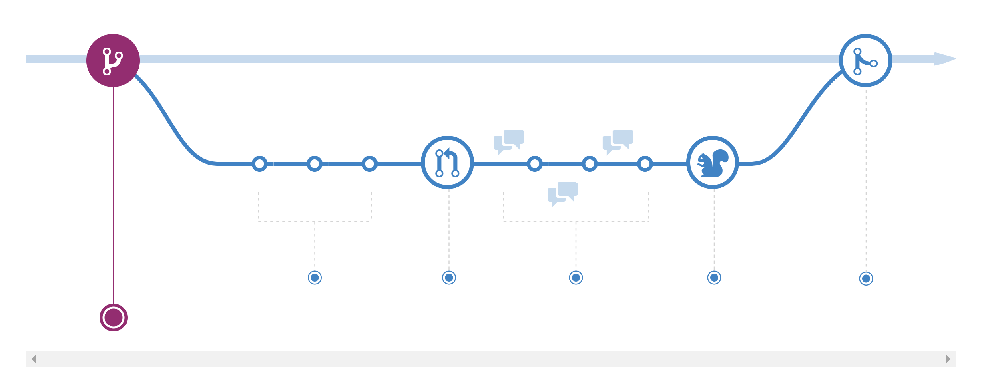
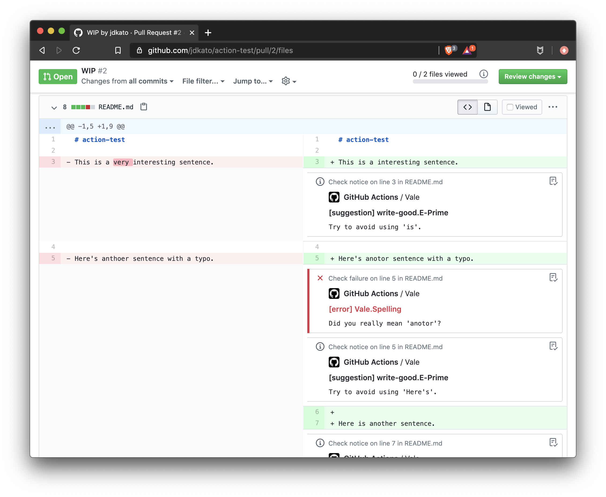

<!-- class: lead -->

# **Practical Docs-as-Code**

Using Sphinx, GitHub, Vale, and ReadTheDocs.

---

<!-- class: lead -->


####   🇪🇸 **David Garcia** (@dgarcia360)

🥑 **Freelance Developer Advocate**

🧑‍💻 APIdocumentation.xyz

---

<!-- paginate: true -->

<!-- class: lead -->

# Good documentation ❤️

---

<!-- class:  -->

# Good documentation ❤️

> Documentation is the entry point of technical audiences to the product.

- Saves others time and energy.
- Helps you remember how code works.
- Increases the product adoption.

---

<!-- class: lead -->

# Writing documentation 🤨

---

<!-- class: lead -->

# Docs become quickly outdated

---

<!-- class: lead -->

# Docs efforts are not usually scoped


---



---

<!-- class:  -->

# Intrdoucing Docs-As-Code

 > Write docs with the same tools and workflows used to code.

- Lightweight Markup Language
- Integrated Development Environment
- Version Control
- Peer Reviews
- Testing
- CI / CD

---

<!-- class:  -->

# Why?

- Promote the collaboration between writers and developers.
- Incentivize devs to write about features while they are fresh.
- Achieve consistency between documents.
- Publish documentation in multiple formats.
- Faster docs releases.

---

# **AGENDA** 🍕

1. Writing documentation

2. Collaboration with Git

3. Testing with Vale

4. Publishing with Sphinx and Read the Docs


*Repository*: github.com/dgarcia360/docs-as-code-workshop

---

<!-- class: lead -->


# 1. Writing documentation

---

<!-- class:   -->


# Where docs should live?

- **Near the source code**.
  (+) Fits well in the development cycle.
  (+) Docs are part of the code.
  (-) Difficult to serve all docs together.
- **Separate repository**
  (+) All docs are in one central place.
  (-) Devs need to contribute in a separate repository.

---

## Markup language

-  Plain text with annotations to format the text.

- Generate multiple formats from raw text.

- HTML, Markdown, restructuredText, AsciiDoc, ...

## IDE

- VSCode, Sublime, Notepad, VIM ...

---

# restructuredText cheatsheet

https://docutils.sourceforge.io/docs/ref/rst/restructuredtext

-  ``**bold**``, ``*italic*, `` `link <http://google.com>`_``

- Headings:

```
Title
=====

subtitle
--------
```

---

<!-- class: lead -->


# 2. Collaboration with Git

---

<!-- class:  -->




*GitHub flow*: https://guides.github.com/introduction/flow/

<!--
* **Version Control**: Git
* **Issue tracking**: GitHub, Bitbucket, Gitlab, Jira, ...
* **Peer reviews**:  Pull-Requests
* **Authorization**: Branch protections -->

---

<!-- class: lead -->


# 3. Testing with Vale

---

<!-- class:  -->

# Style Guide
 
 > Maintain a consistent style, voice, and tone across the documentation.

 Examples:

- https://docs.microsoft.com/en-us/style-guide/welcome/
- https://developers.google.com/style
- https://docs.gitlab.com/ee/development/documentation/

---

# Vale


> Code-like linting for prose.

https://docs.errata.ai/vale/install

-  Enforce the style guide.
- Guide on how to write well.
- Integrates well with CI / CD.

---

# Vale cheatsheet

``.vale.ini``: configuration file.
```
StylesPath = .github/styles
MinAlertLevel = suggestion

[*.rst]
BasedOnStyles = Vale, pizza
```

---

# Vale cheatsheet

Style example.

```
extends: existence
message: "Checks if there are pineapple pizza occurences."
ignorecase: true
level: warning
tokens:
  - hawaiian pizza
  - 🍍🍕
```

---



---

<!-- class: lead -->


# 4. Publishing with Sphinx and ReadTheDocs

---

<!-- class:   -->

# Sphinx

> Sphinx is a tool that makes it easy to create intelligent and beautiful documentation.


-  Originally created for the Python documentation.
- restructuredText -> HTML, PDF…
- Cross-references between pages.
- Power-ups: extensions & themes.

---

# Sphinx cheatsheet

## Requirements

- pip, python 3+

## Installation

```
pip install sphinx
sphinx-quickstart docs
make html
```

---

## Table of contents

```
.. toctree::
   :maxdepth: 2
   :caption: Contents:

   installation
   usage
```

## Cross references

```
Continue: :doc:`Usage <usage>`
```

---

# Power-ups

- Themes: https://sphinxthemes.com
- Extensions: https://sphinxthemes.com/resources

---

# ReadTheDocs


> Hosting for documentation.

https://readthedocs.org/

- Content Delivery Network (CDN)
- Docs multiversion
- Integration with GitHub

--- 

# Summary

- **Markup language**: restructuredText.

- **IDE**: Visual Studio Code + reStructuredText extension.

- **Collaboration**: GitHub flow

- **Testing**: Vale + GitHub Actions

- **Publication**: Sphinx + ReadTheDocs

---

# Receive tips on ✍️ technical writing, 👩‍💻 developer experience, and 🤖 docs-as code.


## apidocumentation.substack.com

